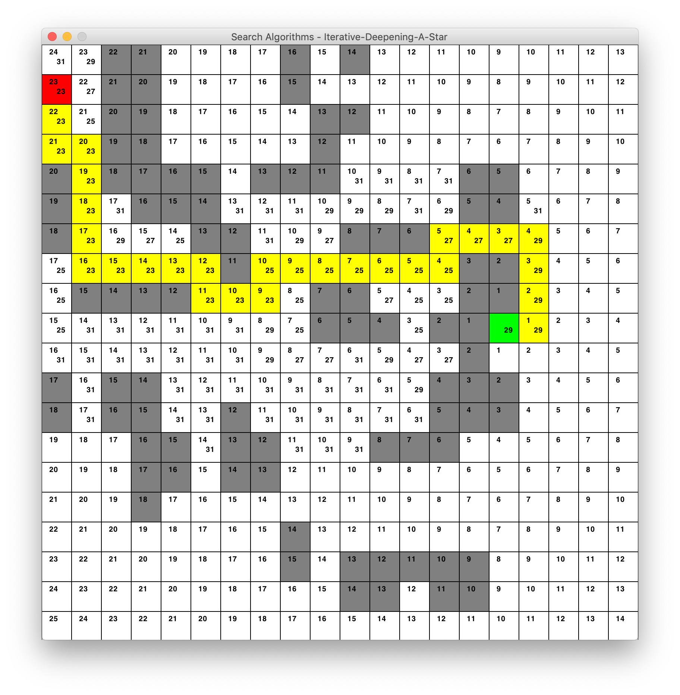

# Search Algorithms

Implementation of various tree-based search algorithms for 2D pathfinding.

The available search methods are:
- **Uninformed**
        - [Breadth First Search](https://en.wikipedia.org/wiki/Breadth-first_search)
        - [Depth First Search](https://en.wikipedia.org/wiki/Depth-first_search)
        - [Uniform Cost Search](https://en.wikipedia.org/wiki/Dijkstra%27s_algorithm)
- **Informed**
        - [Greedy Best First Search](https://en.wikipedia.org/wiki/Best-first_search)
        - [A* Search](https://en.wikipedia.org/wiki/A*_search_algorithm)
        - [Iterative Deepening A* Search](https://en.wikipedia.org/wiki/Iterative_deepening_A*)

## Getting Started

These instructions will get you up and running on your local machine.

### Obtaining Latest Build

The latest build can be found at:
```/out/artifacts/SearchAlgorithms_jar/SearchAlgorithms.jar```

as well as some input files to start with.

### Arguments

- **inputFile**: Path to input file relative to SearchAlgorithms.jar. Must be .txt in the following format:
    - Line 1. Map Size: [x,y]
    - Line 2. Initial Agent Location: (x,y)
    - Line 3. Directional Movement Costs: (up,left,down,right)
    - Line 4. Goal State(s): (x1,y1)|(x2,y2)..|(xn,yn)
    - Lines 5 onwards. Walls (Initial x,y **top left** of wall): (x,y,width,height)
    ```
    [5,11]      //Dimensions
    (0,1)       //Agent Location
    (1,1,1,1)   //Directional Costs
    (7,0)|(10,3)//Goal States
    (2,0,2,2)   //Wall
    (8,0,1,2)   //Wall
    (10,0,1,1)  //Wall
    ```
- **searchMethod**: one of the following available search methods:
    - ```breadth-first``` Breadth First Search
    - ```depth-first``` Depth First Search
    - ```uniform-cost``` Uniform Cost Search
    - ```greedy-best``` Greedy Best First Search
    - ```a-star``` A* Search
    - ```id-a-star``` Iterative Deepening A* Search

- **sleepTime**: Milliseconds spent sleeping between expanding nodes, useful for visualising the searches.


### Usage

**OS X & Linux**:

```
java -jar SearchAlgorithms.jar inputFile searchMethod sleepTime
```

**Windows**:

```
SearchAlgorithms inputFile searchMethod sleepTime
```

### Output

The program is complete with a graphical representation of the search space, frontier and currently expanded nodes. For the simplest form of searches the UI appears as follows:


- **Red**: Initial Agent Position
- **Green**: Goal State
- **Dark Grey**: Wall
- **Light Grey**: Searched Position
- **Magenta**: Current Position
- **Cyan**: Current Frontier
- **Yellow**: Path

The more complex the algorithm, the more data about each node is required and hence is displayed in the environment.



Where cost to each node based on direction (middle) and Manhattan Distance to the nearest goal (top left) is displayed in each position.


The UI is updated in real time however on the same thread as the computation thread so in rare cases will slow down performance of the algorithm itself, this is noticable with IDA* on slower machines.


Upon completion of a search, the program's command line returns:

```
//Successful Completion
inputFile searchType numberOfExpandedNodes elapsedTime(ms)
[PATH,TO,GOAL]

//Unsuccessful Completion
inputFile searchType No Solution Found
```